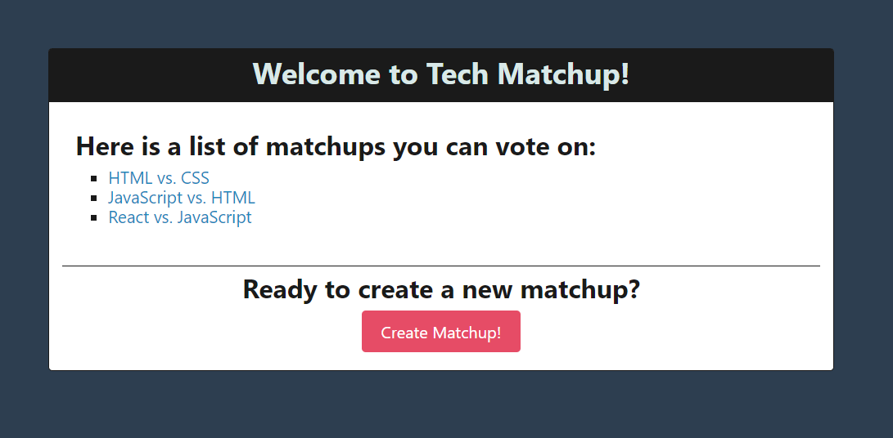

# Tech-Matchup App

This is a MERN-stack application that allows users to create a matchup between two technologies and vote on their favorite technology.

## Deployed Link

https://infinite-caverns-98317.herokuapp.com/

## Screenshot of Application

## Technologies Used

* React
* GraphQL
* Node/Express
* MongoDB

## User Story

* As a user, I want to see a list of matchups and create a matchup between two technologies.
* As a user, I want to be able to vote for one of the technologies in a matchup, and see the current number of votes for each technology in a matchup.

## Personal Note

This application is a great way to get boot camp students more involved in class.  It adds an element of fun to the learning process.